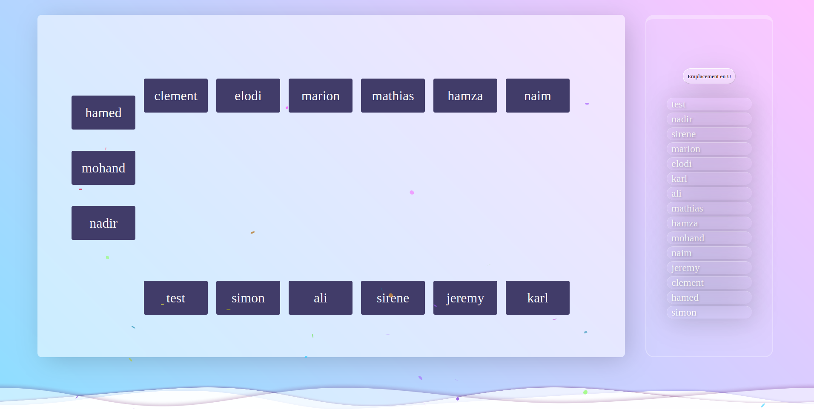

<h2>🚀 Démo</h2>
<a href="https://nadir-where.pro4.garage404.com/Accueil/Accueil.html">WHERE</a>

<h2>🛠 Technologies utilisées</h2>
<ul>
    <li><strong>HTML5</strong> : Structure de l'application</li>
    <li><strong>CSS3</strong> : Mise en page et styles</li>
    <li><strong>JavaScript</strong> : Gestion de la logique et attribution aléatoire des places</li>
</ul>

<h2>🎮 Fonctionnalités</h2>
<ul>
    <li>Attribution aléatoire des places chaque semaine</li>
    <li>Nombre de participants ajustable (moins ou plus de 15)</li>
    <li>Interface simple</li>
    <li>Animation visuelle pour l'affichage des résultats</li>
</ul>

<h2>📷 Aperçu</h2>

